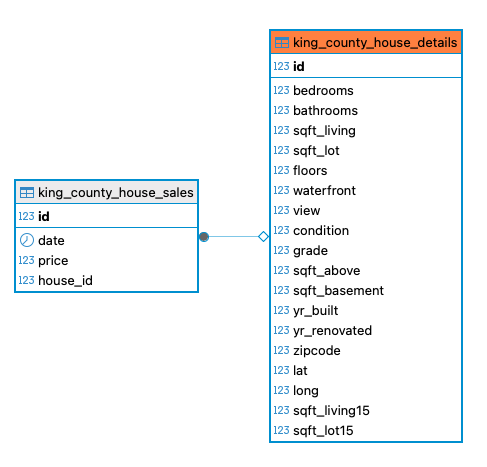

# EDA Project - Murat Kurt

Please read the [motivation](./MURAT_HYPOTHESIS_01_DISTANZ_PRICE_SNIPPET1.ipynb).

- **Project period:** 9th – 11th July 2025
- **Database:** EDA database from SPICED

## Hypotheses and Methods

### Hypothesis 1
**Hypothesis:** The price depends on the distance to the center coordinates of Seattle, Washington (Downtown).

**Methods & Charts:**  
- Calculated the geospatial distance between each property and the Seattle downtown coordinates.
- Used scatter plots to visualize the relationship between price and distance.
- Fitted a regression line to observe the trend.

[Notebook SNIPPET 1](./EDA_HYPOTHESIS_01_DISTANZ_PRICE_SNIPPET1.ipynb)

[Notebook SNIPPET 2](./EDA_HYPOTHESIS_01_DISTANZ_PRICE_SNIPPET2.ipynb)

---

### Hypothesis 2
**Hypothesis:** BOTH, living space and lot size are significant for price.

**Methods & Charts:**  
- Created scatter plots for price vs. living space and price vs. lot size.
- Applied multiple linear regression to assess the combined impact.
- Visualized residuals to check model fit.

[Notebook SNIPPET](./EDA_HYPOTHESIS_02_LIVINGSPACE_SNIPPET.ipynb)

---

### Hypothesis 3
**Hypothesis:** The distribution of grade depends on the ZIP code (981..).

**Methods & Charts:**  
- Grouped data by ZIP code starting with 981.
- Used boxplots and histograms to compare grade distributions across ZIP codes.
- Conducted ANOVA test to verify if differences are statistically significant.

[Notebook SNIPPET](./EDA_HYPOTHESIS_03_MODAL_GRADE_DEP_ZIP_SNIPPET1.ipynb)

---

**Prepared by:** Murat Kurt

## DATA Overview



## Project Assignments

This project is part of an assignment during the SPICED BOOTCAMP course, Data Science and AI.

[EDA ASSIGNMENT](assignment.md)

[Column Names, short description](assignment.md)

## Presentation EDA-Project  

[Murat Kurt Presentation as Keynote](doc/EDA-Project-Murat-Kurt.key)

# SETUP 

## Set up your Environment
This repo contains a requirements.txt file with a list of all the packages and dependencies you will need.

Before you can start with plotly in Jupyter Lab you have to install node.js (if you haven't done it before).
- Check **Node version**  by run the following commands:
    ```sh
    node -v
    ```
    If you haven't installed it yet, begin at `step_1`. Otherwise, proceed to `step_2`.


### **`macOS`** type the following commands : 


- `Step_1:` Update Homebrew and install Node by following commands:
    ```sh
    brew update
    brew install node
    ```

- `Step_2:` Install the virtual environment and the required packages by following commands:

    ```BASH
    pyenv local 3.11.3
    python -m venv .venv
    source .venv/bin/activate
    pip install --upgrade pip
    pip install -r requirements.txt
    ```
### **`WindowsOS`** type the following commands :


- `Step_1:` Update Chocolatey and install Node by following commands:
    ```sh
    choco upgrade chocolatey
    choco install nodejs
    ```

- `Step_2:` Install the virtual environment and the required packages by following commands.

   For `PowerShell` CLI :

    ```PowerShell
    pyenv local 3.11.3
    python -m venv .venv
    .venv\Scripts\Activate.ps1
    python -m pip install --upgrade pip
    pip install -r requirements.txt
    ```

    For `Git-Bash` CLI :
  
    ```BASH
    pyenv local 3.11.3
    python -m venv .venv
    source .venv/Scripts/activate
    python -m pip install --upgrade pip
    pip install -r requirements.txt
    ```
 

